# Hospital Management System

A plain PHP, Bootstrap, and MySQL Hospital Management System built for learning raw PHP before moving to Laravel. It includes separate Admin, Doctor, and Patient portals with a more realistic appointment, consultation, prescription, billing, and receipt workflow.

## Highlights

- Raw PHP/MySQL project, no framework required.
- Role-based access for Super Admin, normal Admin, Doctor, and Patient.
- Patient registration with unique username/email, address, validation, and password visibility controls.
- Doctor application review with qualification, specialization, license/certification, experience, and consultation fee.
- Admin appointment approval, rejection, cancellation, and rescheduling.
- Doctor consultation flow with diagnosis, medicines, dosage, duration, tests, advice, follow-up, and bill creation.
- Prescription access is separate from payment status: patients can view prescriptions before paying.
- Billing supports unpaid, paid, and waived states; receipts are visible only after payment.
- Modern shared UI for dashboards, tables, forms, sidebars, and profile pages.

## Screenshots

The full screenshot set is stored in [`docs/screenshots`](docs/screenshots). Sections below are grouped so the README stays readable.

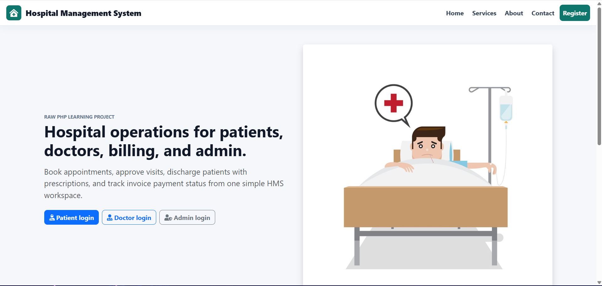

<details>
<summary>Authentication and registration</summary>

<p>
  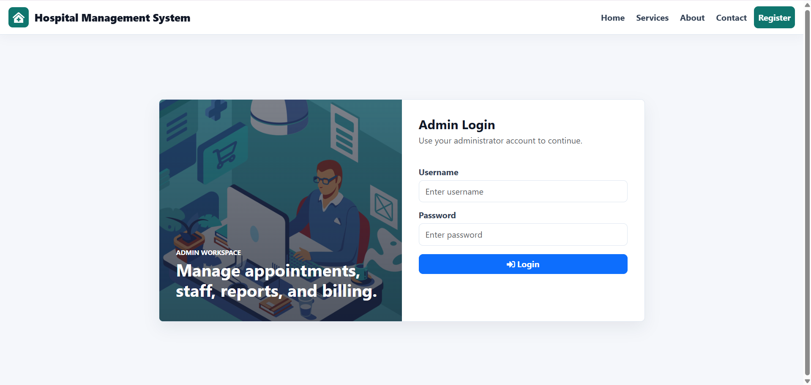
  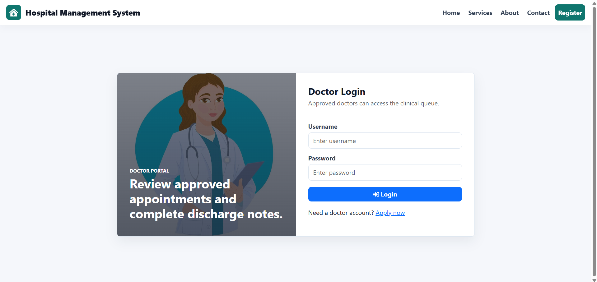
</p>
<p>
  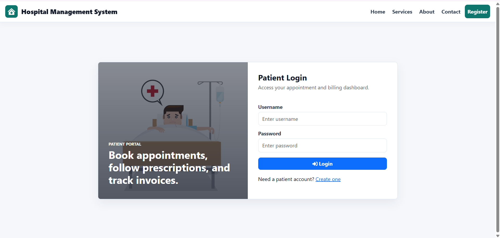
  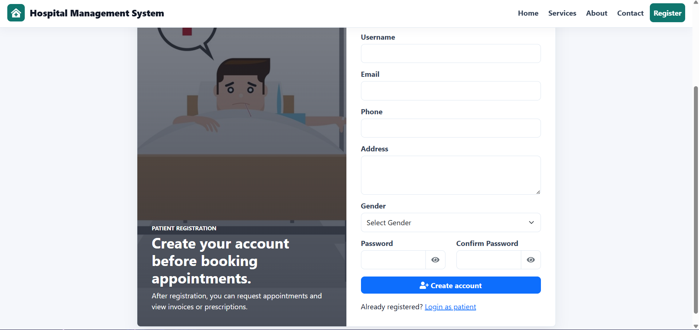
</p>
<p>
  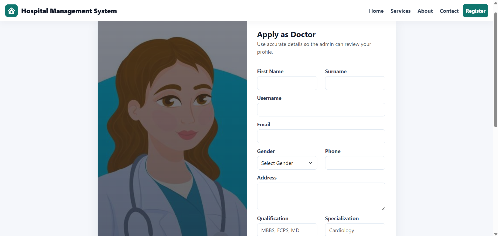
</p>

</details>

<details>
<summary>Admin workspace</summary>

<p>
  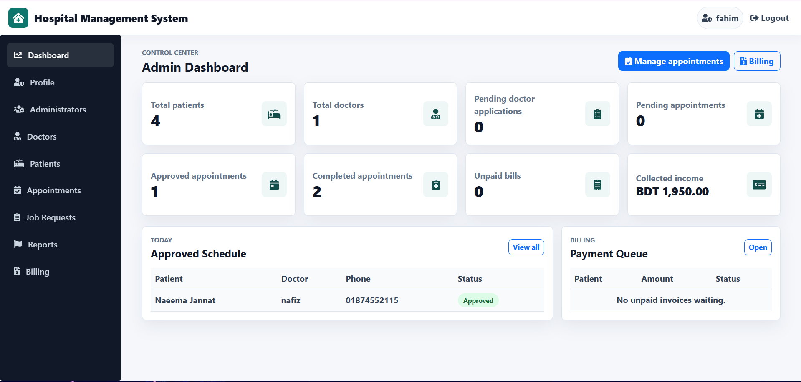
  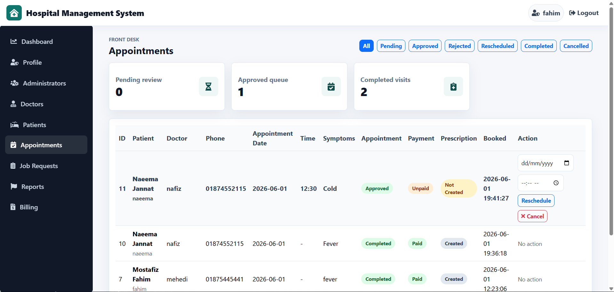
</p>
<p>
  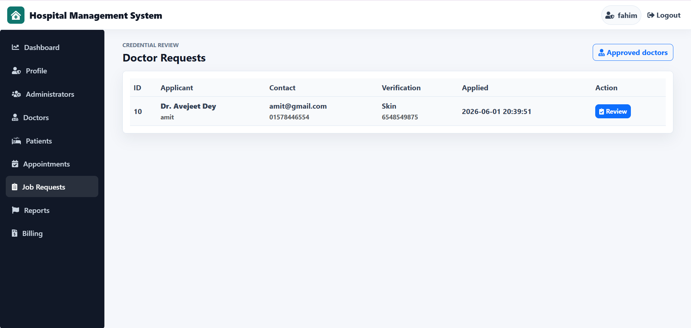
  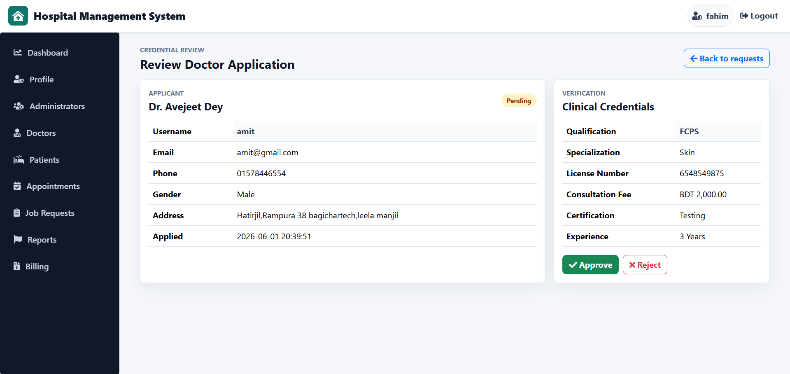
</p>
<p>
  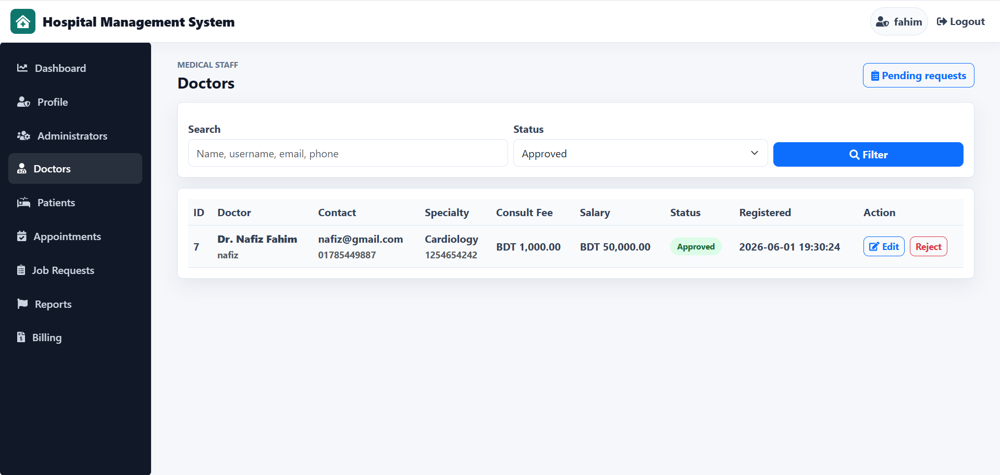
  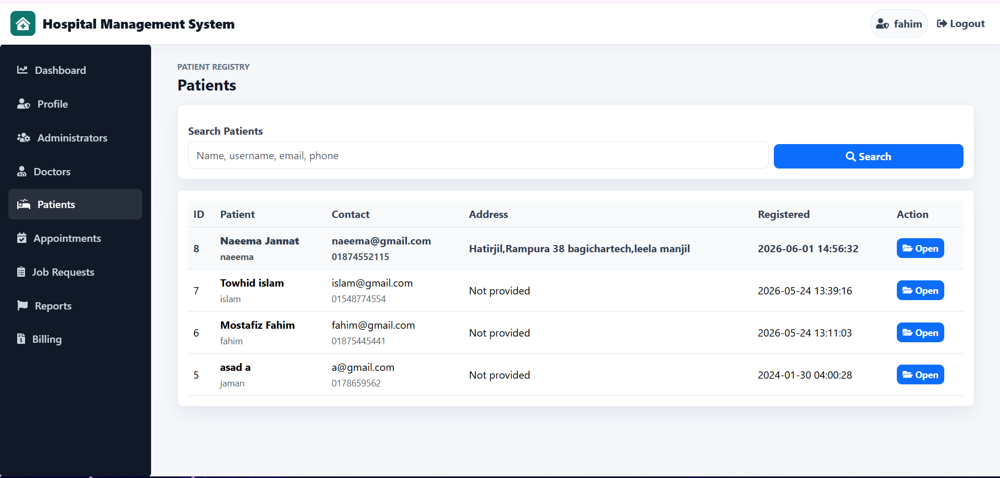
</p>
<p>
  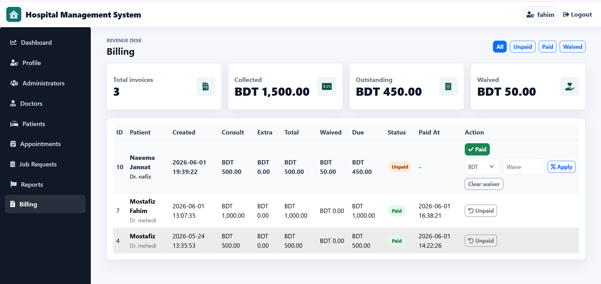
  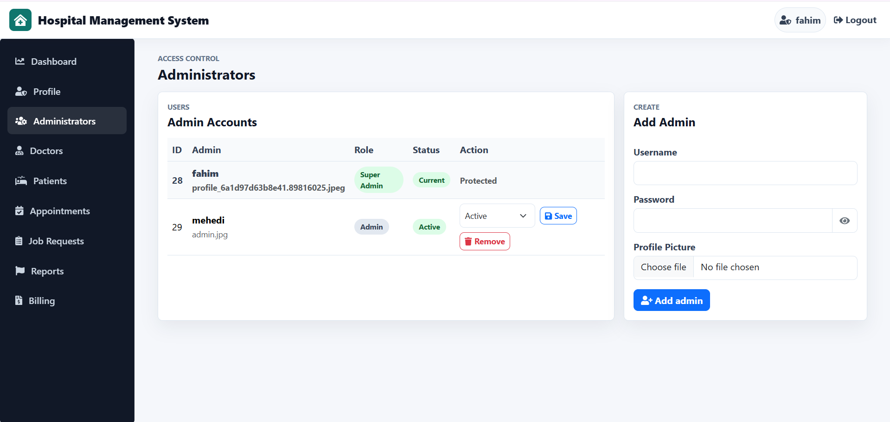
</p>

</details>

<details>
<summary>Doctor and patient portals</summary>

<p>
  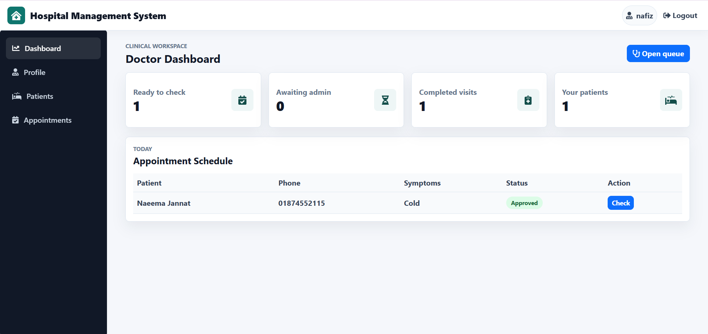
  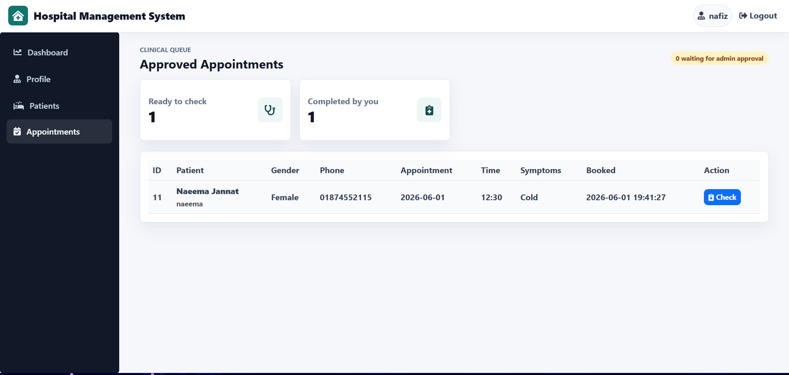
</p>
<p>
  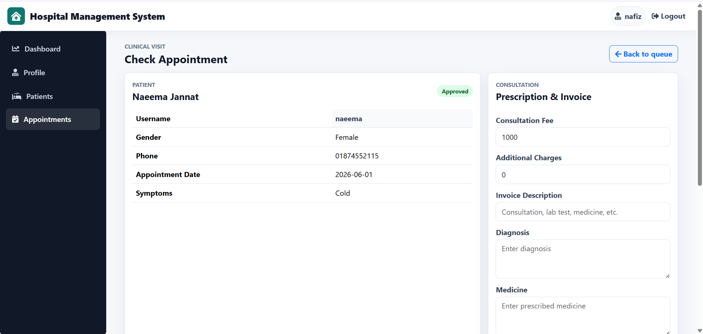
  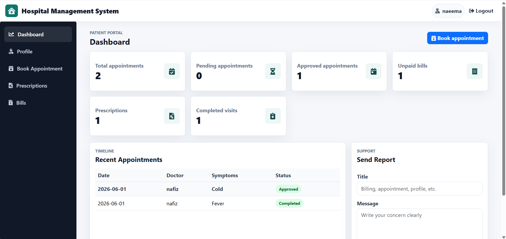
</p>
<p>
  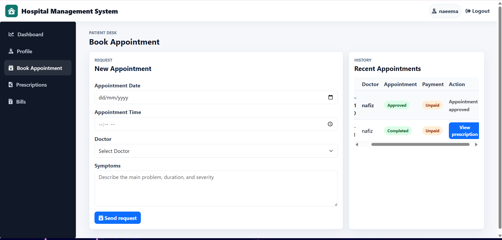
  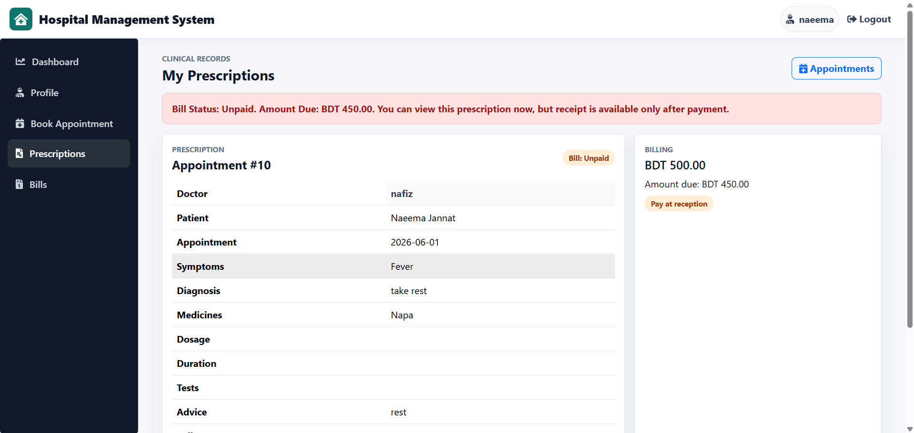
</p>
<p>
  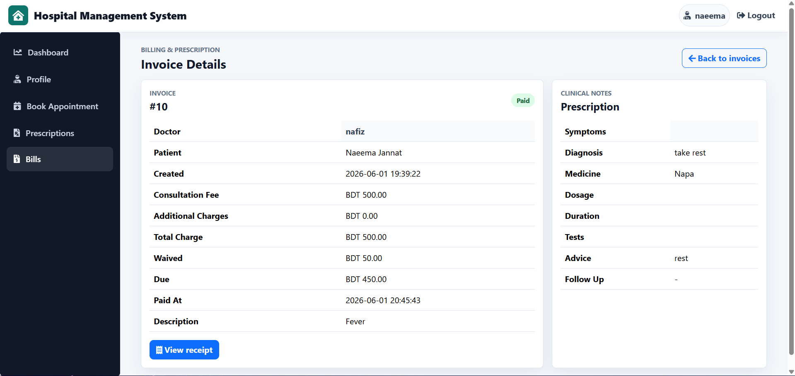
  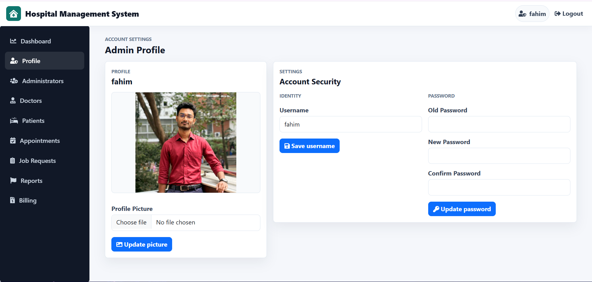
</p>

</details>

## Default Access

Use this Super Admin account after importing the SQL dump:

| Role | Username | Password |
| ---- | -------- | -------- |
| Super Admin | `fahim` | `123456` |

## Setup

1. Copy the project to your XAMPP web root:

```text
D:\Xampp\htdocs\Hospital-Management-System
```

2. Start Apache and MySQL from XAMPP.
3. Create a MySQL database named `hmsDB`.
4. Import [`hmsdb.sql`](hmsdb.sql).
5. Open the app:

```text
http://localhost/Hospital-Management-System/
```

If your MySQL password is different, update [`include/connection.php`](include/connection.php):

```php
$host = "localhost";
$user = "root";
$password = "root";
$database = "hmsDB";
```

## Main Workflow

1. Patient registers and books an appointment.
2. Appointment starts as Pending, Unpaid, and Not Created for prescription.
3. Admin approves, rejects, cancels, or reschedules the appointment.
4. Approved appointments appear in the assigned doctor's queue.
5. Doctor completes consultation and creates prescription plus bill.
6. Appointment becomes Completed and prescription becomes visible to the patient immediately.
7. Bill remains Unpaid until admin marks it Paid.
8. Patient can view prescription before payment, but receipt is available only after payment.

## Project Structure

```text
admin/              Admin dashboard, doctors, patients, appointments, billing
doctor/             Doctor dashboard, appointments, consultation, patients
patient/            Patient dashboard, appointment booking, bills, prescriptions
include/            Database connection, auth guard, shared header/UI helpers
docs/screenshots/   Project screenshots used in this README
hmsdb.sql           Database schema and sample data
```

## Tech Stack

- PHP 8+
- MySQL / MariaDB
- Bootstrap 5
- jQuery
- XAMPP for local development

## Laravel Note

This project intentionally stays in raw PHP for learning. Laravel migration planning files are kept in [`docs`](docs) and [`laravel-blueprint`](laravel-blueprint) for future study.

## Author

Mostafiz Fahim

## License

For academic and learning purposes.
